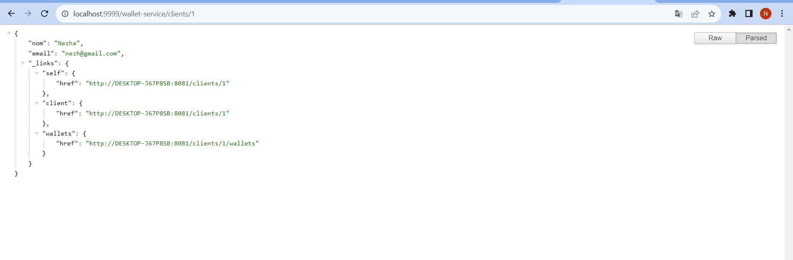

Rapport de l'Évaluation Architectures Micro-services

1. Création un Empty Project incluant les micro-services suivants : wallet-service, transfer-service, gateway-service, discovery-service et config-service :
Aprés avoir demmarer consul en utilisant la ligne de commande et en executant cette commande :
consul agent -server -bootstrap-expect=1 -data-dir=consul-data -ui -bind=ipAdresse
où ipAdresse est l'adresse IP de votre machine.
Je dois configurer le fichier d'acces au service. Pour cela, j'ai creé un fichier nomme config-service et un autre discovery-service

2. Développer et tester les micro-services discovery-service et gateway-service et config-service

3. Développer et tester le micro-service wallet-service
Aprés avoir runner le service wallet-service il est ajouté automatiquement a consul

Voila les donnes dans la base de donnees :
La table Client :

La table Wallet :

en utilisant la gateway :

avec la projection :

5. Développer un simple frontend web pour l’application
Dans ce cas, j'ai utiliser AngularJS pour le frontend car c'est une technologie que je maitrise bien
voici l'affichage des clients :

les wallet de client 1 :

Realise par :
Nezha OUBELLA
GLSID3
